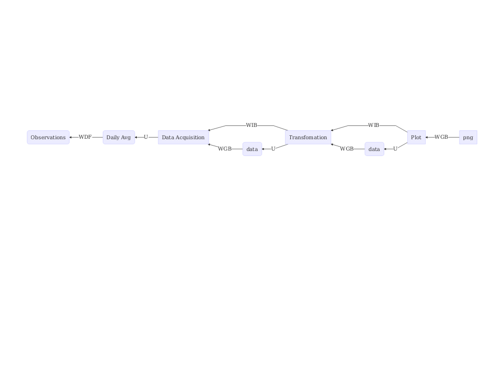

---
output:
  md_document:
    variant: markdown_github
---

<!-- README.md is generated from README.Rmd. Please edit that file -->

```{r, echo = FALSE}
knitr::opts_chunk$set(
  collapse = TRUE,
  comment = "#>",
  fig.path = "README-"
)
```

## Example of Reproducible and Reusable Research 
[](https://travis-ci.org/KNMI/DutchClimate)
[](https://codecov.io/github/KNMI/DutchClimate?branch=master)

```{r, Libraries, include=FALSE}
library(DiagrammeR)
#library(DiagrammeRsvg)
library(magrittr)
library(htmlwidgets)
library(webshot)
```

### Status of the Dutch climate (DRAFT)

Simple flow chart for a time series plot:
```{r, InitialFlowChart, echo=FALSE}
graph <- DiagrammeR::mermaid('
  graph RL
  A["png"] --> |WGB| B
  B["Plot"] --> |WIB|C
  B --> |U|Cdata
  Cdata(data) --> |WGB|C
  C --> |U|Ddata
  C["Transfomation"] --> |WIB|D
  Ddata(data) --> |WGB|D
  D["Data Acquisition"] -->|U|E("Daily Avg")
  E --> |WDF|Obs("Observations")
  ')
saveWidget(graph, 'tmp.html', selfcontained = FALSE)
webshot('tmp.html',
        file = 'inst/img/TimeSeriesPlot.png')
```

- WDF 'was derived by'
- WGB 'was generated by'
- U 'was used by'
- WIB 'was informed by'



We want to focus on the track from 'Daily Avg' to 'png' for now. A description
of the black box process from the 'Observations' to the 'Daily Avg' product
would be highly appreciated.

