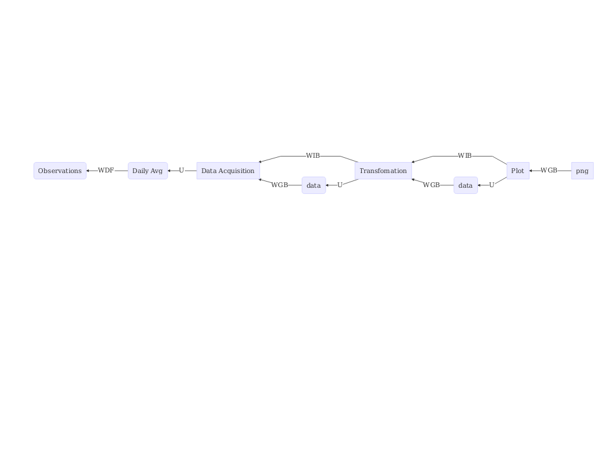

<!-- README.md is generated from README.Rmd. Please edit that file -->
Example of Reproducible and Reusable Research
---------------------------------------------

### Status of the Dutch climate (DRAFT)

Simple flow chart for a time series plot:

-   WDF 'was derived by'
-   WGB 'was generated by'
-   U 'was used by'
-   WIB 'was informed by'

We want to focus on the track from 'Daily Avg' to 'png' for now. A description of the black box process from the 'Observations' to the 'Daily Avg' product would be highly appreciated.
